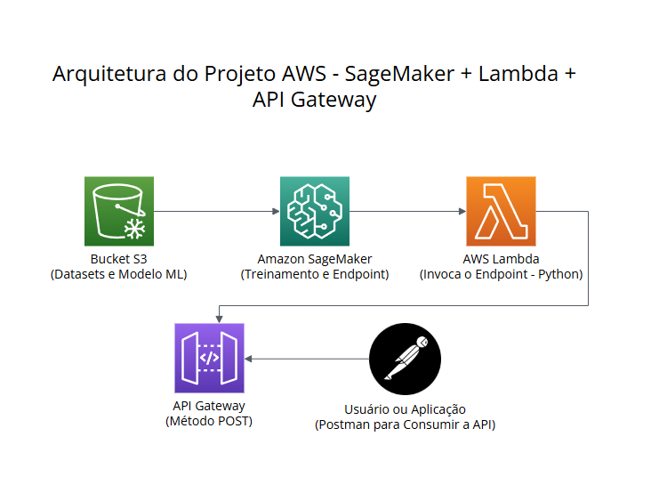
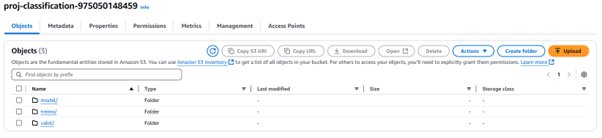
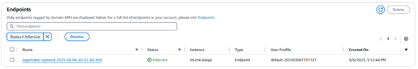
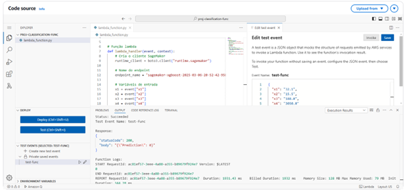
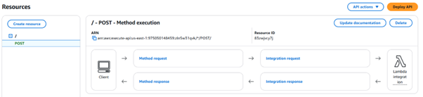
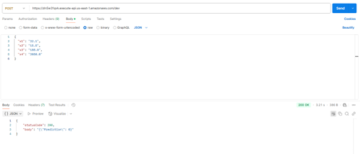

# Projeto de Classificação na AWS

Projeto desenvolvido durante a pós-graduação em Engenharia de Machine Learning pela [Data Science Academy](https://www.datascienceacademy.com.br/).

- Arquitetura do Projeto
- Documentação do Projeto

### Documentação do Projeto:

Bucket S3

Amazon SageMaker Endpoint

AWS Lambda

API Gateway - POST

Postman

